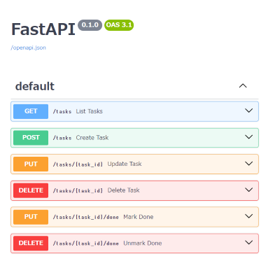

ルーター記述していく

## 機能
パスオペレーション考えていく
- TODOリスト一覧表示  
  (GET) `/tasks`
- TODOにタスク追加  
  (POST) `/tasks`
- タスクの説明文変更    
  (PUT) `/tasks/{task_id}`
- タスクの削除  
  (DELETE) `/tasks/{task_id}`
- タスクを完了にする  
  (PUT) `/tasks/{task_id}/done`  
  ↑ (PATCH)だと思ったが、書籍ではPUTらしい、、、
- タスクを未完了にする  
  (DELETE) `/tasks/{task_id}/done`  
  ↑ (PATCH)だと思ったが、書籍ではPUTらしい、、、

## ファイル
リソース単位でファイル分け  
一ファイルでも良さそうだけど学習のために分割する
- tasks.py
- done.py
```
api
├ __init__.py
├ main.py
├ routers
│ ├ __init__.py
  ├ tasks.py
  └ done.py
```

## 実装
抜粋して記載  
全文はプロジェクトを参照  

`tasks.py`
```py
from fastapi import APIRouter

router = APIRouter()  # インスタンス生成

@router.get("/tasks") # routerインスタンスのデコレータでルート登録
async def list_tasks(): # FastAPIの関数にはとりあえず脳死でasyncつける、つけないとエラーになる（awaitで待とうとするため）
  # ↑ 「list」って動詞的な扱いできるらしい、、、？
    pass

```
↑この枠組みだけの実装を「プレースホルダ」というらしい

<br>

`main.py`
```py
from fastapi import (
    FastAPI,
)
from api.routers import (
    tasks,
    done,
)  # src下からパス指定、勝手にエクスポートしてくれてるらしい

app = FastAPI() 
app.include_router(tasks.router) # appインスタンスにルートを登録
app.include_router(done.router)

```

ここまでしたらSwaggerにでる  
http://localhost:8000/docs#/  
Dockerfileの起動時コマンドにて `--reload` してるから、保存だけでSwagger更新されている  
関数の説明文までSwaggerが自動生成してくれている




