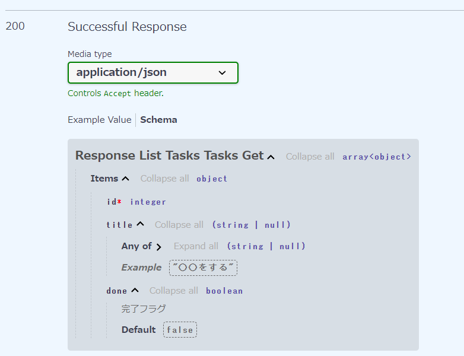

スキーマ実装していく  
スキーマでリクエスト・レスポンスの型定義を行う

## 型ヒント
前の資料でも述べたがPythonはJSと同じように動的な型付け  
なので型定義するにはスキーマで型ヒントを使う

TSと違って型違反していても、エラーを吐いてくれないので注意
```py
num: int = 1
num = "hahaha" # エラーにならない
# 実行をしてもエラーにならない
type(num) # → <class 'str'>
```
じゃあ、何の意味が、、、？  
ドキュメンテーション？

## レスポンスの型定義
まず型定義する
```py
class Task(BaseModel):
    id: int
    title: str | None = Field(None, example="○○をする") # 古いPythonだとパイプが使えないので、Optional[str]と書くらしい
    done: bool = Field(False, description="完了フラグ")
```
example とか description 付ければ Swagger で説明が見れていい↓


APIも型定義に基づいて返却できるようにする
```py
# routerインスタンスのデコレータでルート登録
# FastAPIの関数にはとりあえず脳死でasyncつける、つけないとエラーになる（awaitで待とうとするため）
@router.get("/tasks", response_model=list[task_schemas.Task])
async def list_tasks():
    return [task_schemas.Task(id=1, title="タスク１")]
# ↑「list」って英単語は動詞的な扱いできるらしい、、、？
# キーワード引数を使うことによって引数の順番を気にしなくていい
```
Swaggerで Try it out していい感じになった  

試しに型違反してみる
```py
@router.get("/tasks", response_model=list[task_schemas.Task])
async def list_tasks():
    return [task_schemas.Task(id=1, title=1234)]
```
Try it out したら「500 Error: Internal Server Error」が帰ってきた。  
型違反するとエラーになる

**Python自体の型定義は弱いが、FastAPIの型定義は強いことが分かった**

<br>

余談だが、pycファイル（キャッシュファイル？）はgitignoreに入れてよいものなのか...?