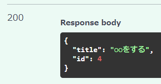

（まだ書く）  
ルーター直していく
Depends とorm_mode = True は大事かも

```py
from fastapi import APIRouter, Depends
import api.schemas.tasks as task_schemas
from sqlalchemy.orm import Session
from api.db import get_db
import api.cruds.task as task_crud

router = APIRouter()  # インスタンス生成

# Depends -> 噂のDI（依存性注入）、これをすることでテスト環境のDBセッションとかを入れられる
# 密結合すぎる状態を防いでる（＝依存性注入）
@router.post("/tasks", response_model=task_schemas.TaskCreateResponse)
async def create_task(task_body: task_schemas.TaskCreate, db: Session=Depends(get_db)):
    return task_crud.create_task(db, task_body)
    # 戻りの型は DBの型「task_model.Task」のはずなのに、スキーマの型「task_schemas.TaskCreateResponse」が返る
    # これは、task_schemas.TaskCreateResponseに「orm_mode = True」を付けたからである、不思議

```

<br>

スワッガーで何個か登録してみた  
idも増えているので自動採番されてそう



