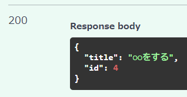
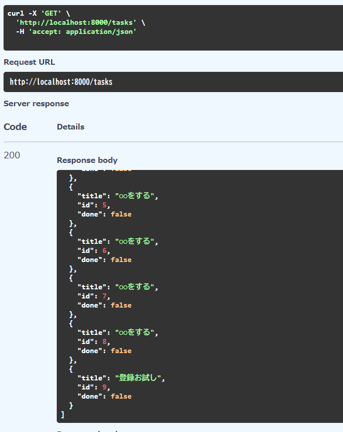

ルーターはMVCのCに当たると思う  
CRUD操作を書くのもCになる  

ただ、ルーターにCRUD操作を書くのは違うので、あらたにファイルを作成する  
その作ったファイルにまず、CRUDのCができるようにしていく  

api/cruds/task.py  
```py
from sqlalchemy.orm import Session

import api.schemas.tasks as task_schema
import api.models.task as task_model


# SQLAlchemyでは、Integer型のカラムが主キーとして設定されている場合、オートインクリメントの挙動がデフォルトで適用されるらしい
# ので、今回は id が無い task_model.Task 型の変数が一時的にできるし、db.refresh(task)で自動採番され取得される
def create_task(db: Session, task_create: task_schema.TaskCreate) -> task_model.Task:
    task = task_model.Task(**task_create.model_dump())  # dict型にして展開
    db.add(task)
    db.commit()
    db.refresh(task)  # DBからマッパー上のオブジェクトを最新化
    return task
```

次にルーターを修正  
cruds/tasksの関数を呼ぶだけ  
Depends とorm_mode = True は大事かも  

api/routers/tasks.py
```py
from fastapi import APIRouter, Depends
import api.schemas.tasks as task_schemas
from sqlalchemy.orm import Session
from api.db import get_db
import api.cruds.task as task_crud

router = APIRouter()  # インスタンス生成

# Depends -> 噂のDI（依存性注入）、これをすることでテスト環境のDBセッションとかを入れられる
# 密結合すぎる状態を防いでる（＝依存性注入）
@router.post("/tasks", response_model=task_schemas.TaskCreateResponse)
async def create_task(task_body: task_schemas.TaskCreate, db: Session=Depends(get_db)):
    return task_crud.create_task(db, task_body)
    # 戻りの型は DBの型「task_model.Task」のはずなのに、スキーマの型「task_schemas.TaskCreateResponse」が返る
    # これは、task_schemas.TaskCreateResponseに「orm_mode = True」を付けたからである、不思議
```

<br>

スワッガーから何個か登録してみた  
idも増えているので自動採番されてそう  



同じノリでCRUDのRも作っていく  

api/cruds/task.py  
```py
from sqlalchemy import select
from sqlalchemy.orm import Session
from sqlalchemy.engine import Result

import api.schemas.tasks as task_schema
import api.models.task as task_model


def get_task_with_done(db: Session) -> list[tuple[int, str, bool]]:
    # resultのこの時点では値が入っていない、all()することで得られる
    result: Result = db.execute(
        select(
            task_model.Task.id,
            task_model.Task.title,
            # task_model.Task.done,　# ← relationship は Python オブジェクト間の関連を表すだけでテーブルに存在するわけではない
            task_model.Done.id.isnot(None).label("done"),  # Doneの存在をbool値として取得
        ).outerjoin(task_model.Done)
    )
    return result.all()

```

api/routers/tasks.py
```py
@router.get("/tasks", response_model=list[task_schemas.TaskGetResponse])
async def list_tasks(db: Session = Depends(get_db)):
    return task_crud.get_task_with_done(db)
```

確認できた  
いい感じ  

